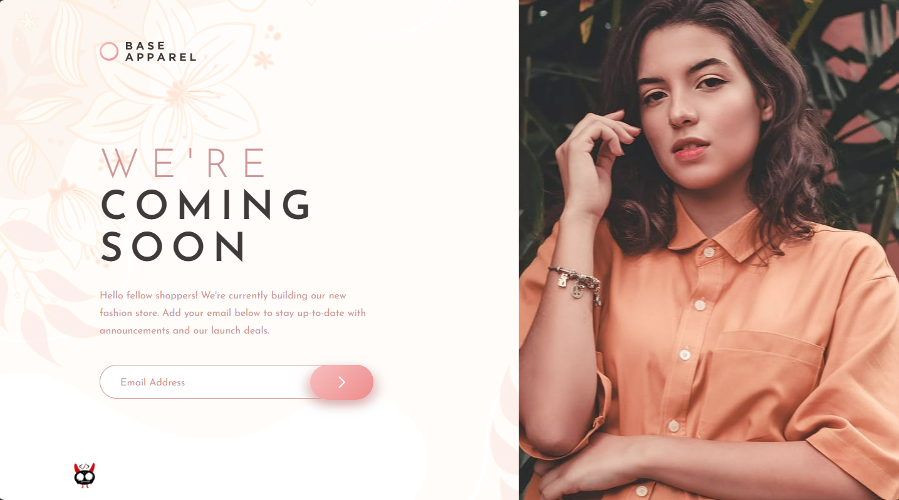

# Frontend Mentor - Base Apparel coming soon page solution

## Table of contents

- [Overview](#overview)
  - [The challenge](#the-challenge)
  - [Links](#links)
- [My process](#my-process)
  - [Built with](#built-with)
  - [What I learned](#what-i-learned)
  - [Continued development](#continued-development)
  - [Useful resources](#useful-resources)
- [Author](#author)

## Overview

### The challenge

Users should be able to:

- View the optimal layout for the site depending on their device's screen size
- See hover states for all interactive elements on the page
- Receive an error message when the `form` is submitted if:
  - The `input` field is empty
  - The email address is not formatted correctly

### Links
- Solution URL: [Solution URL here](https://www.frontendmentor.io/solutions/responsive-section-coming-soon-html-js-pure-css-py-31L0hlM81o)
- Live Site URL: [Live site URL here](https://grimm-n.github.io/base-apparel-coming-soon/)

## My process

### Built with

- HTML5
- Pure CSS
- Flexbox
- Grid
- JavaScript
- Python
- Mobile-first workflow

### Continued development

My goal remains the same: to learn how to create perfectly mobile-adapted websites. I'm dedicated to mastering this skill.

### Useful resources

- [Freepick](https://www.freepik.com/) - I downloaded the backgroud image from this site.
- [A (more) Modern CSS Reset](https://piccalil.li/blog/a-more-modern-css-reset/) - Thanks again to Andy Bell for his wonderful cheat sheet! I'm using it, adapting it to my needs, and I highly recommend it to everyone.

## Author

- LinkedIn - [Natali Grimm](https://www.linkedin.com/in/grimm-n/)
- Frontend Mentor - [@Grimm-N](https://www.frontendmentor.io/profile/Grimm-N)
- Twitter - [@Grimm__N](https://x.com/Grimm__N)
